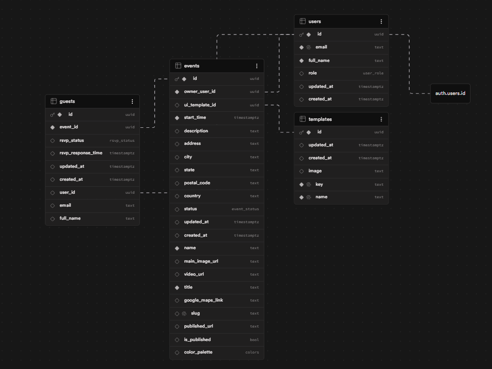

# EventTap

EventTap is a full-stack event management and RSVP platform. Hosts can create, manage, and publish events with guest lists; invitees receive email invitations and can RSVP through a dedicated event page.

---

## Setup

### Prerequisites

- Node.js 18+
- A [Supabase](https://supabase.com) project

### 1. Install dependencies

```bash
npm install
```

### 2. Configure environment variables

Copy `.env.example` to `.env.local` and fill in the values:

```bash
cp .env.example .env.local
```

| Variable                               | Description                                                                      |
| -------------------------------------- | -------------------------------------------------------------------------------- |
| `NEXT_PUBLIC_SUPABASE_URL`             | Your Supabase project URL                                                        |
| `NEXT_PUBLIC_SUPABASE_PUBLISHABLE_KEY` | Your Supabase anon/publishable key                                               |
| `SUPABASE_SERVICE_ROLE_KEY`            | Your Supabase service role key (for elevated DB access)                          |
| `NEXT_PUBLIC_APP_URL`                  | Base URL of the app (e.g. `http://localhost:3000`)                               |
| `RESEND_API_KEY`                       | (Optional) [Resend](https://resend.com) API key — required for invitation emails |

Both Supabase keys are found in your project dashboard under **Settings > API**.

### 3. Run the development server

```bash
npm run dev
```

The app will be hosted at [http://localhost:3000](http://localhost:3000).

---

## Running Tests

```bash
npm test
```

Tests are written with [Vitest](https://vitest.dev) and [Testing Library](https://testing-library.com). Test files live in `__tests__/`.

---

## Architecture

```
EventTap
├── Next.js (App Router)     — client/server architecture with server-side rendering
├── Supabase                 — database, authentication, row-level security
├── Resend                   — transactional email (event invitations)
└── Vercel                   — deployment
```

### Directory Structure

```
app/                  # Next.js App Router pages
  auth/               # Login, signup, password reset
  dashboard/          # Host dashboard (manage events)
  events/
    [slug]/           # Public-facing event page (RSVP)
    events/           # Host event list
  settings/           # User settings and profile

components/           # Reusable UI components
  dashboard/          # Dashboard-specific components
  events/             # Event form, guest list, RSVP, stat cards, templates
  ui/                 # Base UI (shadcn/ui)

lib/
  data/               # Server-side data access functions
  supabase/           # Supabase client initialization (client, server, proxy)
  auth.ts             # Auth helper utilities
  utils.ts            # Shared utilities

__tests__/            # Vitest unit/component tests
supabase/             # Supabase config and migrations
```

## Database Schema Overview



### Data Flow

1. **Authentication** — handled by Supabase Auth with cookie-based sessions via `@supabase/ssr`. Middleware validates sessions on every request.
2. **Event creation** — hosts create and edit events through the dashboard. Events are stored in Supabase and remain in draft state until published.
3. **Publishing** — when a host publishes an event, the app generates a unique slug-based URL and (if configured) sends invitation emails to the guest list via Resend.
4. **RSVP** — guests visit the public event URL and submit their RSVP. Responses are written directly to Supabase. Hosts can see live RSVP stats in the dashboard.

### Key Technology Choices

| Concern         | Choice                   | Reason                                                         |
| --------------- | ------------------------ | -------------------------------------------------------------- |
| Framework       | Next.js App Router       | Client/server architectures                                    |
| Database + Auth | Supabase                 | Managed Postgres with row-level security; integrated auth      |
| Styling         | Tailwind CSS + shadcn/ui | Utility-first CSS with accessible, composable components       |
| Email           | Resend                   | Simple API for transactional email; optional/graceful fallback |
| Testing         | Vitest + Testing Library | Fast, ESM-native test runner compatible with React             |
